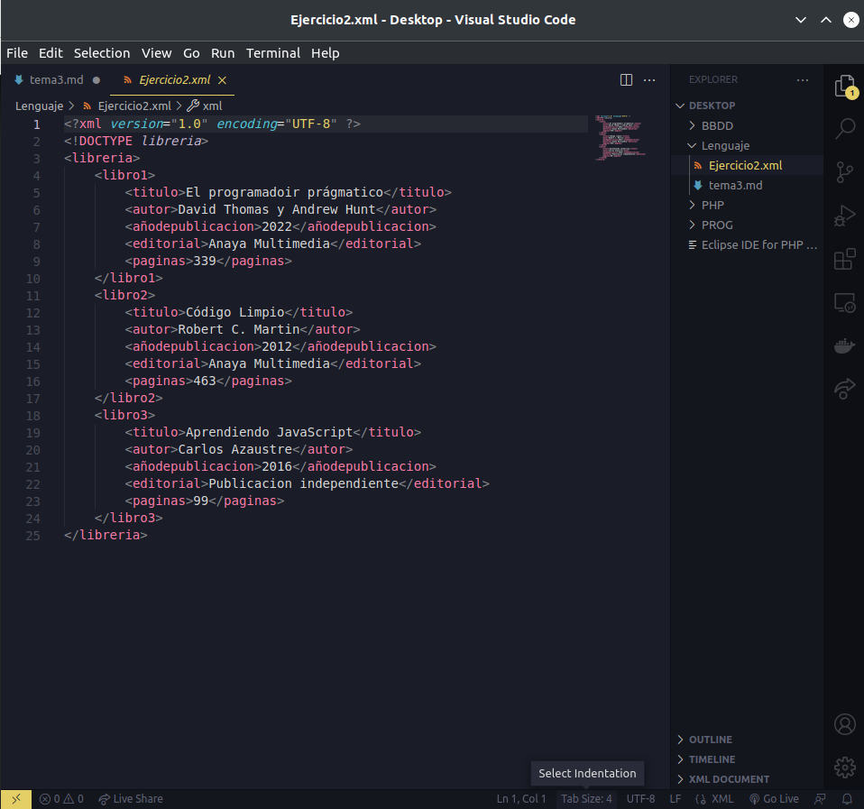

# **TEMA 3**
+ ## XML
> Es un lenguaje que permite la estructuración y la ordenación de la información que se compone como en html de etiquetas escalonadas en forma de árbol.

```xml
    <compania>
        <departamento>
            <trabajador>
                <nombre>Luisa</nombre>
                <apellido>Dominguez</apellido>
            </trabajador>
            <trabajador>
                <nombre>Juan</nombre>
                <apellido>Vazquez</apellido>
            </trabajador>
        </departamento>
        <departamento>
            <trabajador>
                <nombre>Marcos</nombre>
                <apellido>Dominguez</apellido>
            </trabajador>
        </departamento>
    </compania>
```
Editores: Notepad++, VS Code.

### **Estructura**
+ Prólogo

```xml
    <?xml version="1.0" encoding="UTF-8" standalone="yes" ?>
    <!DOCTYPE compania>
```
+ Ejemplar

```xml
    <compania>
        <departamento>
            <trabajador>
                <nombre>Mauro</nombre>
                <cargo>Supervisor</cargo>
                <dni>23090876T</dni>
            </trabajador>
        </departamento>
        <departamento>
            <trabajador>
                <nombre>Luisa</nombre>
                <cargo>Secretaria</cargo>
                <dni>09064356Y</dni>
            </trabajador>
            <trabajador>
                <nombre>Marcos</nombre>
                <cargo>Jefe de Seguridad</cargo>
                <dni>112454672L</dni>
            </trabajador>
        </departamento>
    </compania>
```


## **EJERCICIOS XML**

> + **Ejercicio 1**: Realmente en Linux ni Notepad, ni Notepad++ esta disponible, sin embargo podemos encontrar alternativas como Notepadnext en el caso de Notepad++ o Notepadqq en el caso de Notepad.

<br />

> ### **Notepadqq**
> 

<br />

> ### **Notepadnext**
> 

<br />

> ### **Visual Studio Code**
> 

> Cada uno de estos editores de código son usados para codear en xml, sin embargo, a diferencia de las versiones originales estas no son compatibles con extensiones o no esta bien documentadas. Esto no impide su uso, es más en el caso de **notepadqq** si acepta extensiones aun que su configuración se compleja. 
>
> En mi opinión y desde mi punto de vista Visual Studio es de los mejores editores básicamente por su uso regular dada la comunidad de desarrolladores, tiene mas soporte y extensiones que permiten la edición de xml de forma mas sencilla. En VSCode existen las extensiones de XML Tools y XML creada por Red Hat 
, siendo la primera la  más antigua y por ende la mas desarrollada y perfecionada yo tengo claro que VSCode es el editor mas práctico porque consigue reunir todas las funcionalidades necesarias y más. Además de que visualmente es mas bonito a mi parecer.

<br />

### **Ejercicio 2**:
[!xml2](/XML/Ejercicio2.xml)

<br />

### **Ejercicio 3**:
[!xml3](/XML/Ejercicio3.xml)

<br />

### **Ejercicio 4**
[!xml4](/XML/Ejercicio4.xml)

<br />

### **Ejercicio 5**: 
[!xml5](/XML/Ejercicio5.xml)

<br />

### **Ejercicio 6**:
[!xml6](/XML/Ejercicio6.xml)

<br />

### **Ejercicio 7**: 
[!xml7](/XML/Ejercicio7.xml)

<br />

### **Ejercicio 8:**
[!xml8](/XML/Ejercicio8.xml)

<br />

### **Ejercicio 9:**
[!xml9](/XML/Ejercicio9.xml)

<br />

### **Ejercicio 10:** Hacer un dpocumento XML con <![CDATA[]]>
[!xml10](/XML/Ejercicio10.xml)

<br />

# **XML DOCUMENT TYPE DEFINITION**

### **Ejercicio 11:** Haz un XML con DTD
[!xml11](/XML/Ejercicio11.xml)

<br />

### **Ejercicio 12:** Hacer XML con DTD EMPTY
[!xml12](/XML/Ejercicio12.xml)

<br />

### **Ejercicio 13:** Hacer XML con DTD
[!xml13](/XML/Ejercicio13.xml)

<br />

### **Ejercicio 14:** Hacer un xml con DTD específico
[!xml14](/XML/Ejercicio14.xml)

<br />


<br />

### **Ejercicio 15:** Haz un DTD 
[!xml15](/XML/Ejercicio15.xml)

<br />

### **Ejercicio 16:** Haz un XML con DTD teniendo en cuenta los operadores(?, *, +, |)
[!xml16](/XML/Ejercicio16.xml)

<br />

### **Ejercicio 17:** Haz un XML del ejercici 12 con algun operador
[!xml17](/XML/Ejercicio17.xml)

<br />

### **Ejercicio 18:**
[!xml18](/XML/Ejercicio18.xml)

<br />

### **Ejercicio 19:**
[!xml19](/XML/Ejercicio19.xml)

<br />

### **Ejercicio 20:**
[!xml20](/XML/Ejercicio20.xml)

<br />

### **Ejercicio 21:** añade un atributo al anterior xml
[!xml21](/XML/Ejercicio21.xml)

<br />

### **>Ejercicio 22:** Haz un DTD de un XML
[!xml22](/XML/Ejercicio22.xml)

<br />

### **Ejercicio 23:** Haz un DTD
[!xml23](/XML/Ejercicio23.xml)

<br />

### **Ejercicio 24:** Haz un XML
[!xml24](/XML/Ejercicio24.xml)

<br />

### **Ejercicio 25:** Haz un XML con  entidades
[!xml25](/XML/Ejercicio25.xml)

<br />

## **XML SCHEMA DEFINITION**

### **Ejercicio 26 y 27:** Haz un XSD
[!xml26y27](/XML/ejercicio26y27.xml)

### **Ejercicio 28** Haz un XSD
[!xml28](/XML/ejercicio28.xml)

### **Ejercicio 29, 30 y 31** Haz un XSD
[!xml29y30y31](./XML/ejercicio29y30y31.xml)