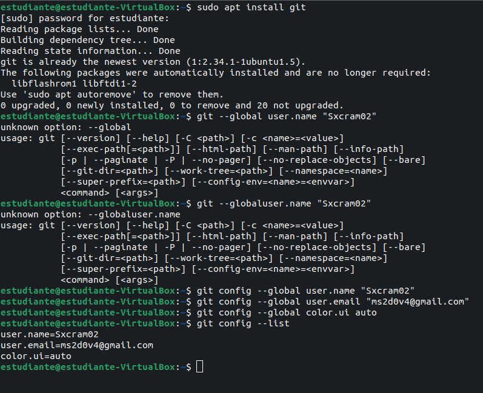
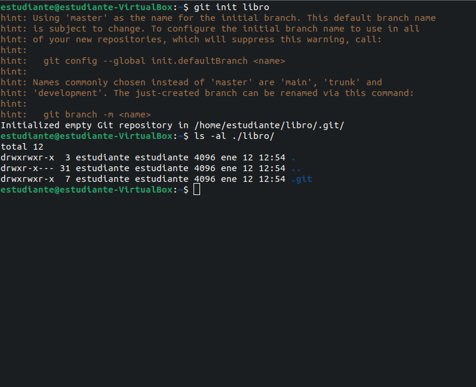
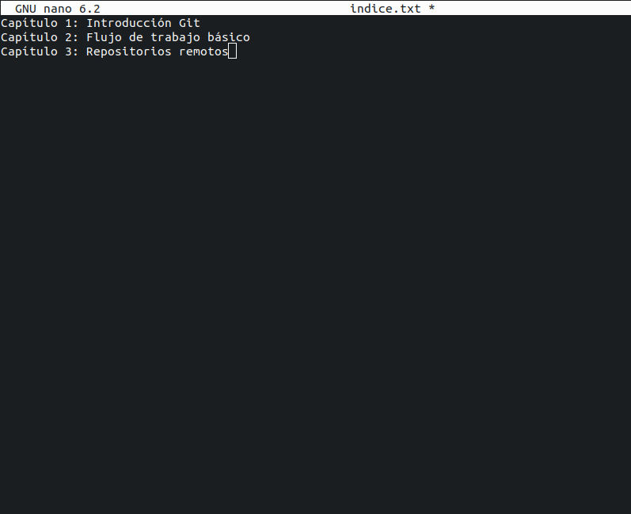
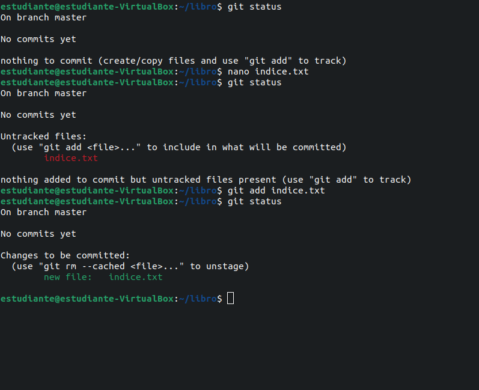
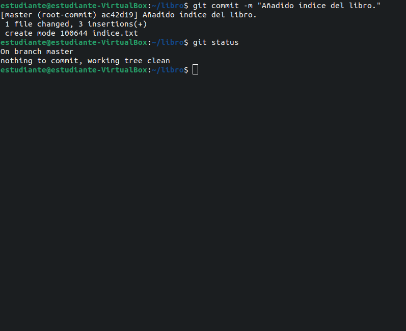
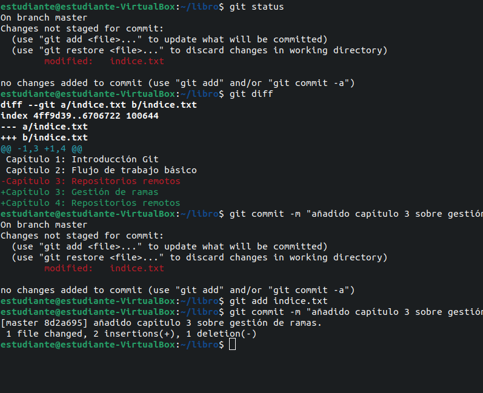
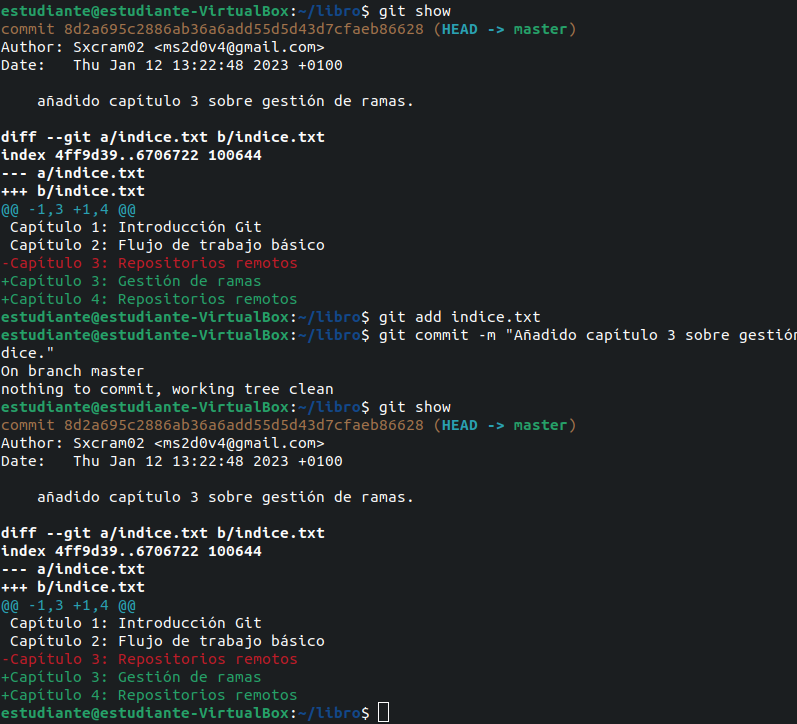

# Entornos de desarrollo

> Git es un repositorio de control de versiones que permite la creación, seguimiento y azctuaización de tus trabajos de forma local o remoto que permite una serie de características:


**Ejercicio 2 y 3:**

> Nosotros empezamos configurando git tanto el usuario com el email, seguido de la inicialización del primer repositorio:

```bash
    sudo apt install git
    git config --global user.name "string"
    git config --global user.email example@example.com
    git config --global color.ui auto
    git config --list
    git init "example" o "/../../"
```





**Ejercicio 4 y 5:**(añade y haz un commit)
> Mas adelante empezamos con la edición de archivos:

```bash
    git status
    git add **fichero**
    git add **carpeta**
    git add
    git rm **fichero**
    git rm --cached **fichero**
    git -mv **fichero** **nuevo-fichero** 
    git commit -m "comentario"
    git commit --amend "comentario"
```




**Ejercicio 6 y 7:**
> cambia el archivo indice.txt muestra los cambios y haga un commit, muestre la diferencia y los cambios 
```bash
    git status
    git diff 
    git diff --cached
    git diff HEAD~1
    git add indice.txt
    git commit -m "mensaje"
    git show
    git show <añadido capítulo 3 sobre la gestión de ramas.>
    git show HEAD~X
```




**Ejercicio 8** Muestra los cambios con git log y agrega una carpeta ademas de un archivo de texto.
```bash
    git log 
    mkdir capitulos
    nano capitulos/capitulos.txt
    git add .
    git commit -m "Añadido capitulo 1"
    git log
```


**Ejercicio 9:** Crear un fichero en la carpeta.
```bash
    git log
    nano capitulos/capitulo2.txt
    git add .
    git commit -m "Añadidio capitulo 2"
    git diff HEAD~2..HEAD
```


**Ejercicio 10:** Crea un capitulo 3
```bash
    git log
    nano capitulos/capitulo3.txt
    git add .
    git commit -m "Añadido capítulo 3."
   git diff ac42d19a5c97c2387852e9df7ebd5fe1bf1ab583: HEAD
```


**Ejercicio 11:** Muestra el autor de los cambios
```bash
    nano capitulos/indice.txt
    git add .
    git commit -m "Añadido capitulo 3"
    git annotate/blame
```


**Ejercicio 12** crear repositorio:
```bash
    mkdir git-local
    cd git-local/
    git init .
    echo "Hola git" >> git.html
    git status
    git add -A
    echo "Marcos" >> git.html
    git status
    git restore git.html
    echo "Dominguez Vega" >> git.html
    git status 
    git commit -m "Confirmado repositorio"
    git add -A
    echo "1ºDAW" >> git.html
    git status
    git add -A
    git restore --staged git.html
    git commit -m "Confirmados los cambios"
    git show 
    git diff hash: HEAD
    git diff hash: hash
```

**Ejercicio 13** modificaciones
```bash
    nano indice.txt
    git status
    git checkout hash -- HEAD
    git status
```

**Ejercicio 14**eliminaciones
```bash
    nano indice.txt
    git add -A
    git status 
    git reset indice.txt
    git status 
    git checkout HEAD -- indice.txt
    git status
```

**Ejercicio 15** eliminaciones
```bash
    nano indice.txt
    git rm capitulos/capitulo3.txt
    touch capitulos/capitulo4.txt
    git add -A
    git status
    git reset
    git status
    git reset HEAD
    git status
```

**Ejercicio 16** 
```bash
    nano indice.txt
    git rm capitulos/capitulo3.txt
    git add -A
    git commit -m "Borrado accidental"
    git log
    git reset --soft hash
    git log
    git status
    git commit -m "Borrado accidental"
    git reset --staged hash
    git log
    git status
```

**Ejercicio 17**
```bash
    git branch bibliografia
    git branch -av
```

**Ejercicio 18**
```bash
    touch capitulos/capitulo4.txt
    echo "En este capítulo veremos cómo usar GitHub para alojar repositorios en remoto" >> capitulos/capitulo4.txt
    git add -A
    git commit -m "Añadido capítulo 4"
    git log --graph --all
```

**Ejercicio 19**
```bash
    git checkout bibliografia
    touch bibliografia.txt
    echo "Chacon, S. and Straub, B. Pro Git. Apress" >> bibliografia.txt
    git add -A
    git commit -m "Añadida primera página referencia  bibliográfica"
    git log --graph --all
```

**Ejercicio 20**
```bash
    git branch -av
    git merge bibliografia
    git log --graph --all
    git branch -d bibliografia
    git log --graph --all
```

**Ejercicio 21**
```bash
    git branch bibliografia
    git checkout bibliografia
    echo "Scott Chacon And Ben Straub. Pro Git. Apress." && echo "Ryan Hodson.Ry's Git Tutorials. Smashwords(2014)" >> bibliografia.txt
    git add -A
    git commit - m "Añadida nueva referencia bibliográfica"
    git checkout HEAD
    echo "Chacon, S. and Straub, B. Pro Git. Apress." && echo "Loeliger, J. and McCullough, M. Version control with Git. O’Reilly." >> bibliografia.txt
    git add -A 
    git commit -m "Añadida nueva referencia bibliográfica"
    git merge bibliografia 
    echo "Chacon, S. and Straub, B. Pro Git. Apress" && echo "Loeliger, J. and McCullough, M. Version control with Git. O'Reilly" && echo "Hodson, R. Ry's Git Tutorials. Smashwords (2014)" >> bibliografia.txt
    git add -A
    git commit -m "Resuelto conflicto de bibliográfia"
    git log --graph --all
```